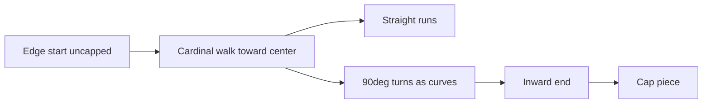

# Pipe placement (procedural, accent-safe)

## Footprint choice

**Procedural from a seed** is the smallest fit for your rules. The layout is constrained by constants (7 starts, angular spacing, 2 long / 5 short, 50px / 200–400px), not by unique hand paths. Hand waypoints would cost dozens of coordinate pairs and still need the same piece-assembly code. Drop **diagonal** for v1 to shrink the orientation table.

## Accent / orientation model

Atlas facts (from `sprites.png`):

- Straight `9×6` @ (38,9): horizontal; dark accent (`747474`) on the **bottom** metal row
- Curve `9×9` @ (47,9): L-bend; accent on the outer/bottom-right of the bend
- Cap `5×8` @ (33,9): terminal; accent on the “bottom” of the stub

Lighting rule to preserve at every seam: **horizontal → accent bottom; vertical → accent right.**

## `createSprite` updates (in scope)

[`createSprite`](src/sprites.ts) **will be extended** for this work — approved, not a workaround. Minimum: add `rot90` (0–3, CCW) to the bake so vertical straights keep the accent on the **right** (`rot90 = 1`: former bottom → right). Canvas width/height swap when `rot90` is odd. Curve/cap orientations are a **whitelist** of `{flipH, flipV, rot90}` — never free rotate/flip, or accents break. Further bake tweaks are fine if port alignment needs them.

Pieces connect in **world pixels** via ports (side + offset), not the 11px tile grid. Measure port centers once from the atlas and store as small numeric tables next to the piece defs.

## Path generation (7 pipes)

New module [`src/pipes.ts`](src/pipes.ts), readable / flat (per SPEC rules 1–3):

1. After [`generateMap`](src/map.ts), call `generatePipes(seed)`.
2. Place **7 starts** on the map border, spaced by angle: `θ = i * τ/7 + phase`. Ray from center through θ → border pixel; snap start onto a coarse **pipe step grid** (step ≈ straight advance after outline overlap, measured from art — expect ~7–8px along-axis).
3. Pick **2 indices** (fixed or seeded) as **long** runs: walk until distance to center ≤ 50px.
4. Other **5** are **short**: walk until distance from the starting edge is in **[200, 400]** (seeded length per pipe).
5. Walker: mostly step toward center on the dominant axis; with a low probability (or when blocked by water/wall if we care later), insert a **single 90° jog** then resume — each direction change emits a **curve**, runs of equal direction emit **straights**.
6. **Caps:** only on the inward terminus. Edge origin is treated as extending off-map → **no cap** there.
7. Output a flat array: `{ canvas, x, y }[]` (same shape as debug props). No classes.

Collision can wait; optional later AABB from opaque bounds.

## Integration

- Bake pipe piece variants once (shared canvases per orientation, referenced by many placements).
- Draw in [`src/index.ts`](src/index.ts) after tiles, before/with player (under or over player — default **under** player).
- Rebake with palette via existing `rebakeAllSprites`.
- Keep any pipe debug overlays in [`src/debug.ts`](src/debug.ts) only.
- Update [`SPEC.md`](SPEC.md) briefly: 7 edge-origin runs, 2 near-center, short range 200–400, ortho pieces only, accent orientation rule.

## Verification

- Dev: 1–7 color toggles still grey metal correctly; visual check that dark seams are continuous at joins; caps only on inward ends; two pipes near spawn, five shorter from edges, roughly even angular spacing.
- `npm run build` once to note byte delta (no golfing yet).
