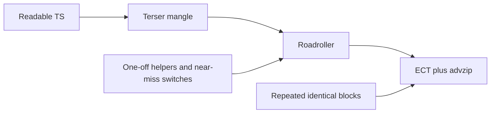

# Size budget audit (2026-08-17)

Reference only — no further cuts planned from this pass. Immediate items (example PNG out of `public/`, dead canvas attrs) are done.

## What 40.5% actually is

`npm run build` is `tsc && vite build` with default [`js13kViteConfig()`](../vite.config.ts):

Terser (5 passes) → imagemin on PNGs → Roadroller (JS+CSS inlined into `index.html`) → html-minifier → ECT zip → advzip (`insane`).

Snapshot at audit time:

- **advzip: 5390 bytes (40.49% of 13,312)**
- Zip contents then: `index.html` (all JS/CSS) + `sprites.png` (~0.72 kb after imagemin) + **`example-pipe-placement.png`** (~0.10 kb) — PNG since removed from `public/`
- Vite transformed **12 modules** — production game only. [`src/debug.ts`](../src/debug.ts) is a dynamic `import()` behind `import.meta.env.DEV` and is not in that 12. [`src/_sample-game/`](../src/_sample-game/) is **not bundled** (still type-checked/linted).

An earlier build without the example PNG was **4801 bytes (36%)**. HTML also grew `5.10 → 5.71 kB` across that same window (pipe/hitbox work), so most of the jump is JS, not the extra image.

**SPEC budget vs then:** ~1 kb sheet (on track), ~2–3 kb engine (present), ~5–6 kb world+gameplay — but that 5–6 kb is supposed to cover combat, 7 minibosses, 7 powers, color wave, save, UI. Today it is almost entirely **pipe generation**. Audio (~1.5–2 kb) is still unused. Remaining headroom after that zip: **~7.9 kb** for all of that. Tight, but the code is not in crisis; the pipe module is the expensive unique system.

Terser already strips comments/types and mangles names. **Do not shorten identifiers.** That is golf-later and does not help the zip.

---

## a) Extraneous (ships, or unique code with no prod reader)

**Done from this pass:**

- `public/example-pipe-placement.png` — was not referenced; Vite copies all of `public/` into the zip. Removed from `public/`.
- [`index.html`](../index.html) leftover sample attrs (`width="240" height="135"`, `tabindex="0"`) — stripped. `resize()` sets canvas size; input is on `window`.

**Ships but keep (future content):**

- Unused atlas on [`public/sprites.png`](../public/sprites.png): Business Man/Boss, 8 enemies, 4 flowers, font row, empty padding to 220×50. Production only samples unicorn, portal halves, and four pipe pieces. PNG is already ~0.72 kb; empty space compresses well. **Do not crop future art** unless you later measure a crop of *empty padding only*.
- [`src/_sample-game/`](../src/_sample-game/) — not in the zip. Optional: exclude from `tsconfig` `include` so `tsc` is faster. Zero packed-size effect.
- [`rebakeAllSprites`](../src/sprites.ts) / `bakedSprites[]` — unused in prod today, required for color unlock. Keep.
- [`wasPressed` / `pressedKeys` / `clearPressedKeys`](../src/input.ts) — only debug reads `wasPressed`, but `index.ts` still calls `clearPressedKeys()` every frame, so the `Set` ships. Keep if abilities/menus are next (SPEC); otherwise dropping the edge-triggered path is a small, clean cut.

**Already fine:**

- Debug overlay, comments, JSDoc, TypeScript types.
- `player.facing` and `DIR_*` in [`src/player.ts`](../src/player.ts) — unused readers, but facing art is TBD. Leave.

---

## b) Overly verbose / complex (mostly OK by SPEC rule 1)

[`src/pipes.ts`](../src/pipes.ts) is ~half of production TS (~700 of ~1400 loc). The occupancy grid, `buildPipe` turn policy, kits, and portal placement **are** the game’s unique system. That complexity is justified; golfing the walker for bytes now would fight “readable first” and save an unpredictable amount.

Worth simplifying *for correctness/maintainability*, not panic-golf:

- Four nearly-identical direction switches: `straightPreview`, `pushStraight`, `pushCap` (insets `-1`/`-3`), `portalFromCell`. Same shape, different literals — this is the “near-miss” pattern Roadroller hates more than honest duplication.
- `curvePreview` vs `pushCurve` repeat enter/exit/flip lookup.
- `mapPort` reimplements the flip+rot90 already in sprite bake, only to fill ports that could live as numbers on `cornerDefs`.
- [`src/player.ts`](../src/player.ts) collision is the right model (AABB + axis slide; pipes are not tile-aligned). The `minOverlappingTileEdge` / `maxOverlappingTileEdge` pair with `'left'|'top'|…` strings is wordier than needed, not architecturally heavy.
- [`pixelScale`](../src/sprites.ts) (always `1`) adds nested `px/py` loops, extra fields, and default args. Unique bake path with no caller. Safe to remove unless you plan non-1:1 sprites (SPEC says 1:1).

**Do not “DRY” identical copies of `mulberry32`.** SPEC rule 3: zip/Roadroller like identical repetition. Two copies of the same RNG may already compress; extracting a shared helper should be **measured**, not assumed.

---

## c) Poorly compressible (the real zip tax)

Roadroller/zip punish **unique tokens and near-duplicate control flow**, not long names.

Highest-confidence compressible issues:

1. **Near-miss 4-dir switches in pipes** (preview vs push vs cap). A small table of `{dx, dy, ox, oy, capInset}` used by both preview and push would make remaining code more self-similar. Measure with a build-both.
2. **`pixelScale` nested loops** — unique, unused.
3. **`mapPort`** — unique transform; replace with literal ports on `cornerDefs`.
4. **Two direction encodings** — player `DOWN=0, UP=1, LEFT=2, RIGHT=3` vs pipes `E=0, N=1, W=2, S=3`. Remaining `if (dir === …)` blocks cannot share constants. Unifying is a readability+compression win when you next touch both files; not worth a dedicated refactor alone.
5. **String edge names** in player snap — tiny unique strings.
6. **Grass speckles via full RNG in [`src/map.ts`](../src/map.ts)** — 8 hardcoded `fillRect`s would drop a second RNG *if* you also delete that copy (only then does it matter). If you keep `mulberry32` in pipes, an identical copy in map is not expensive.

[`src/palette.ts`](../src/palette.ts) quantization aliases (`0xff8300` etc.) and `greyOf` are SPEC-required, not waste. Unused exports `RED`/`BLUE`/`VIOLET` are erased by Terser.

---

## Later, if you want cuts (measure before/after)

When next touching these files — not a current task:

- Drop `pixelScale` from bake.
- Precompute curve ports; delete `mapPort`.
- One 4-dir geometry table for straight/cap preview+push.
- Optional: drop `pressedKeys` until abilities exist.
- Confirm `vite build` still says **12 modules** (no debug chunk).

**Do not do as a dedicated golf pass:**

- Shorten names, merge `mulberry32` without measuring, rewrite `buildPipe`, crop future sprites, delete `_sample-game` for zip reasons, golf collision into per-pixel masks.

**Budget takeaway:** 40% used with movement + pipes + empty grass is the warning, not the comments. Treat [`src/pipes.ts`](../src/pipes.ts) as the piece that must stay stable; new systems (combat, audio, UI) should reuse existing patterns (kits, AABB `hits`, `createSprite`, `isDown`) rather than adding more one-off engines.
